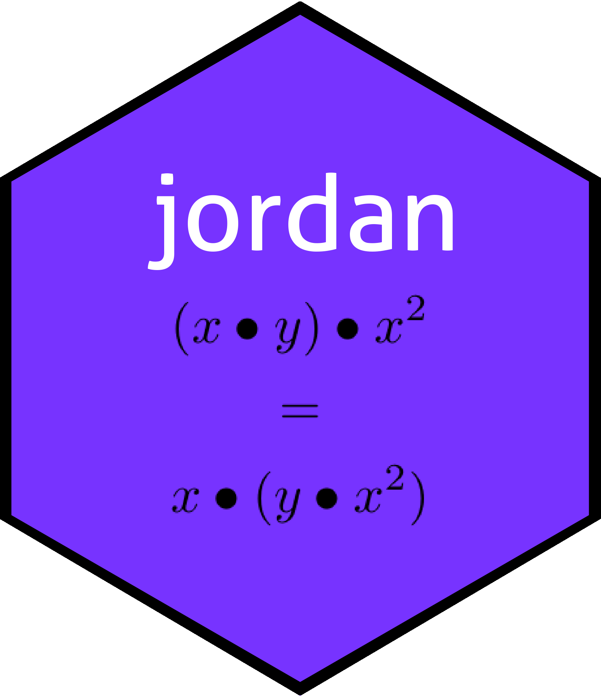

<!-- README.md is generated from README.Rmd. Please edit that file -->




[](https://cran.r-project.org/package=jordan)


[](http://www.rdocumentation.org/packages/jordan)


```{r setup, include = FALSE}
knitr::opts_chunk$set(
  collapse = TRUE,
  comment = "#>",
  fig.path = "man/figures/README-",
  out.width = "100%"
)
```

A _Jordan algebra_ is a non-associative algebra over the reals with
a bilinear multiplication that satisfies the following identities:

$$xy=yx$$

$$(xy)(xx)=x(y(xx))$$

(the second identity is known as the Jordan identity).  In literature
one usually indicates multiplication by juxtaposition but one
sometimes sees $x\circ y$.  Package idiom is to use an asterisk, as in
`x*y`.  There are five types of Jordan algebras, all of which have
their own representation in the package, which uses S4 methods.

# Further information

For more detail, see the package vignette

`vignette("jordan")`
